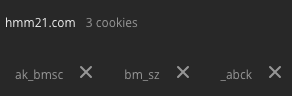
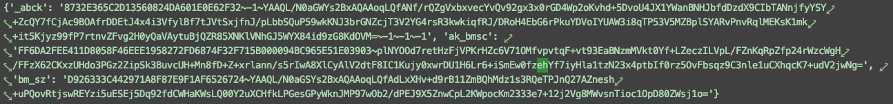

# HDMU

FlowChart
===
```

               START
                 |
                 ⌵
            +---------+ 
            | Cookies +------<---------<---------+
            +----+----+                          |
                 |                               |
                 |                               ^
                 |                               |
                 ⌵                               |
            +---------+   FAIL                   |
            |   Main  +--->--->--->---+          ^
            +----+----+               ⌵          |
                 |                    |          |
                 |                    |          |
                 |                    |          ^
                 ⌵                    ⌵          |
           +-----------+   FAIL       |          |
           | Container +--->--->--+   |          |
           +-----+-----+          |   |          ^
                 |                |   |          |
                 |                ⌵   ⌵          |
                 |             +---------+       |
                 ⌵             |  Retry  +---->--+
              FINISH           +---------+

```

Cookies
===
## 目的
response 上有我們要的 cookies

```
method = 'GET'
URL = 'https://www.hmm21.com'
HEADERS = {
    'Upgrade-Insecure-Requests': '1',
    'Host': URL,
}
```

## Flow
response 如果有 cookies
* 進入 Main

response 如果沒有 cookies
* 重跑 Cookies

## postman
確認 cookies 存在



## requests
HDMU 會擋 requests 內建 User-Agent 因此要換一個 User-Agent

```
HEADERS['User-Agent'] = 'Mozilla/5.0 (Macintosh; Intel Mac OS X 10.15; rv:67.0) Gecko/20100101 Firefox/67.0'

hmm_session = requests.Session()
hmm_session.update(HEADERS)

cookies_response = hmm_session.get(url=URL)
if not cookies_response.cookies:
    raise RuntimeError
```
確認 cookies 存在




Main
===
## 目的
response html 上有 mbl 的資料

response html 上有 Container 的所需資料

## 準備
Cookies 有拿到 cookies

```
method = 'POST'
URL = 'https://www.hmm21.com/ebiz/track_trace/trackCTP_nTmp.jsp'
HEADERS={
    'Upgrade-Insecure-Requests': '1',
    'Host': 'https://www.hmm21.com',
    'Referer': 'www.hmm21.com',
},
FORM_DATA = {
    'number': mbl_no,
    'type': '1',
    'selectedContainerIndex': '',
    'blFields': '3',
    'cnFields': '3',
    'is_quick': 'Y',
    'numbers': [
        mbl_no, '', '', '', '', '', '', '', '', '', '', '', '', '', '', '', '', '', '', '', '', '', '', '',
    ],
}
```

Container
===
## 目的
response html 上有我們要的 container 資料

## 準備
在 Main response html 裡 container table 的
* container_index
* 按發的 request 所遞減的變數: h_num

```
method = 'POST'
URL = 'https://www.hmm21.com/ebiz/track_trace/trackCTP_nTmp.jsp?US_IMPORT=Y&BNO_IMPORT={mbl_no}'
HEADERS={
    'Upgrade-Insecure-Requests': '1',
    'Host': 'https://www.hmm21.com',
    'Referer': 'www.hmm21.com',
},
FORM_DATA = {
    'selectedContainerIndex': f'{container_index}',
    'hNum': f'{h_num}',
    'tempBLOrBKG': mbl_no,
    'numbers': [
        mbl_no, '', '', '', '', '', '', '', '', '', '', '', '', '', '', '', '', '', '', '', '', '', '', '',
    ],
}
```

Availability
===
## 目的
response html 上有 container 的 ready for pick

## 準備
如果在 container 頁面有 Availability herf 存在

```
method = 'POST'
URL = 'https://www.hmm21.com/ebiz/track_trace/WUTInfo.jsp'
HEADERS={
    'Upgrade-Insecure-Requests': '1',
    'Host': 'https://www.hmm21.com',
    'Referer': 'www.hmm21.com',
},
FORM_DATA = {
    'bno': mbl_no,
    'cntrNo': f'{container_no}',
}
``` 


