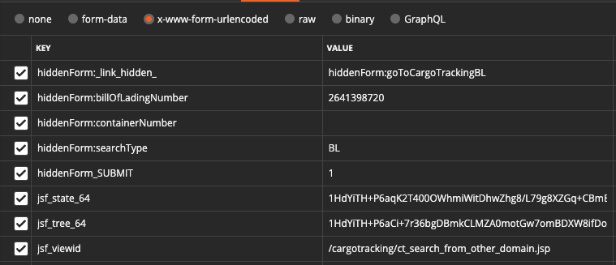

# OOLU

FlowChart
===
```

               START(renew IP)
                 |
                 ⌵
            +---------+
            |  Token  + <-----<-------+
            +----+-+--+               |
                 | |                  ^
                 | ⌵  FAIL(renew IP)  |
                 | +--->------>-------+
                 ⌵
        +----------------+
        | Cargo Tracking |
        +--------+-------+
                 |
                 |
                 |
                 ⌵
        +------------------+
        | Container Status +
        +--------+---------+
                 |
                 |
                 |
                 ⌵
              FINISH

```

Token
===
## 目的
response headers 上有後續所需 cookies 
* cookie key = JSESSIONID

response html 上有後續所需 token
* input
    * id = USER_TOKEN
    * id = jsf_tree_64
    * id = jsf_state_64
    
```html
<input type="hidden" id="USER_TOKEN" name="USER_TOKEN" value="AhKikJsQRehJvNqtZpUjMCCOOCL" />
<input type="hidden" name="jsf_tree_64" id="jsf_tree_64" value="1HdYiTH+P6aCi+7r36bgDBmkCLMZA0motGw7omBDXW8ifDoFRmtL2tZ8gkvZjz4VxXiR+IeF1KXrZq9G0/aFjQ4YQ2pcHx4X/OfYgS0PXHPzYsTwanH8Hz5ZWtEZszvNPHR5j6GxQw9dytLI3FhMFcO+J7MPPIxUsDE3or9Pr5v4N3QkX6thQLJd65vyupBKNg0DHGO0EgPMvfwQFF1j0hAfqNgeQMfd03yaDw01ZPcrw2HBtlW/gT5wahDbvlssEip5LA+pQb3zkeEvs+xDOKIx6e/UT6QKAmXG1XU/x3J29bk4G+nZhsqS0flFBgZlZmV9tlRkYKxiMxczmJN1sKE4TdxGg6abXtlug4iJsF8Z06Owl9q7OK3hu44BAa+rUBKzhyQFTK66KIU6TjsxP+1eMOMUD4mE5uGOjqMD7Z35caQZJnIUDdoGs1T58tPIyxiIhJJn1G5q+9Emaw3jeDmsVDd4qH6Th5SDc2iW2ULZ7NVu6GU4dKR/nbgU1QdRtckqnoXzBf5FDPKYb65aU61DxoTR2ykqskVGoz9+eihj+uAFWVUc35b/dCBxOhIRInmrxvAUEN6m34ZJSpGqf0KHWF7kXE+l4nfxJCP7dxc+xNx44C4ySw==" />
<input type="hidden" name="jsf_state_64" id="jsf_state_64" value="1HdYiTH+P6aqK2T400OWhr8UtH1aAiEx8/L79g8XZGoCrJfsuNi70eDO/sZhs/WAhLgqYD6UHmHFC/lHw1LoiTI2BO4Dul3vRjPbaWMFw7TZLfI04yo5rWZ0yKruSEgf0EngzUxDna4Q0boExvP8JtSlZPb41jcizZ39bTL9XB85Bni3VaJ4RQoAzhs2VhgPQ+GXCFriKAfDnRN9zDiMf2hSclB1nxxOjofitt4XqMY9qVCekcX1sI30ILHqXbgxZ3EghWKGlfhTzk8cpv+7mkH9XpqLX4oNC1rU4JBNexMFoWjZLz7N2VPzX/HOt8Pycd1IHwgSE4ybiXHRCMPLzIziyJ6Ja6uAVJbzvsW/SKqDQLmH3axIiu1JuBebEi7JEkex2bozhwW8IhJVm6ghDK2ZjRkgMgyCn18Qi3mYO82i7XYyDz1WDVksuFQN9WiiWvWqs5mremR3YHycscVofKz4vipvcWvQSF5HRCWLAOOKSJDeYavQDw9rYnX8lSooiJOjeGcyJxbHq/47Kb/L8iljvdrmbUCSdjye+gHJiNlnzhq0vcek0+RPOMrnU7TeG/6ocXBtgciO7/xzuB7TimW39jEuCu4FajyZrJUkKD8LJ3rFWyYgm5DwSaL5+SgxewhAk67iN2dqy/IOlz+CynS2S8nVRqprxtkeG4T/o91n9fcFz43rj8nG9J9kUuRkPY40hdKWfepxMgwX2NhYXavDgC135OsAob+Ws+iVdTcN0MUusUayvAJNq8RbBmvAxGVG3JCN9MMe4EMIB+mhQaziOfV9gNqWC4DgcZtXeUv4M+MlYk1XmTQVoQHqO9wnaLGmKnUqwKMkj8RoCgcN28kNr7g+fMZ9aC/wYHe6rpp67y10I2T0DfjUGU9gzLJfSmqWW6SNH8mx7nPtwlr94PdsZCRcC83ZHM4PbsZlRb026eKbGszgm2tOWGQd+vWYcV8nx0vMeTs5AomC19+fj9dkl3LS9fhdljQnV9ldHlJhuUinpscLQJHXPy44CsAOdrteO/neMTc2P5wR+CTgcGEitxwkwIPtlPKPbPPL5GEGtDFpSGsi9fU0slzRZ0QnTttviPOR8RTacAqBfuZo5ygbDZRkdI67ryRMQLcbV/BXsYK7aPM3R4wN/hCMke/yv2DHtL9C4oCBMSgvOeFZ49X8CZtnFpGllN0Sk3GaX7ojYFwoX3JDLXcNdmGdTe+AJ/+KJWK4uPvfd8wKnkP2R6VlZ+3/EEVGKV0Hb4Fcn2tmcgEIWl+57iO0/pZ+rOnMQWHWmRStWUArZ9Px5U3aHG6I9uk14jWOWLwkYGA1WTxehWvKD6yj2mqYTCEGLVt8LcYFIYmEcgEY1w32ZYgpOT6pc5bnOvecph5y6g0gd83I8x2j9DykzxqN/qoBArzPANjGXMu23e+PBFY3cA2Z5XAbdnm/itf3IUsqBuEAA0JWEkBRPPf5MWne1Q09rTZAvNOZBull/RSm0vFJ/2s1RBxn1ETOb57nywk7xckAnLs/nmzSN1bwP3DfKV9oaB2/ebSVp7dWNDhcZSSmO1HZEGtjA95eA0ClpgwsVYycH2KKq4yOvsR/i0C67bU0diXz0xUm85/1D8zkrbBPMWEi2GZxeIU/aOwckD3MYjI9oIWduRkynVi4lHTbF+3AlNrUsWVmdZba3vXqY48QHv/208edgWWKnomQB5UP/YOrOO+OrYiPUf5i9tkDTAxbvC3fHu2t+g/s3aU9ZCH4FgWy/7k6A2R814SILcw+UpjQATiFrDFqxZJRDXZet9hudS/i+XMaT+NuqiwaIuk06Ya+/Vw3ZMyh5J3XA+Vv1gHDtp1IA8GNqAj7IJe9JpFpV6v65mdve0gUtAJVq6wd74jUgbQ41gaYDPIQjNWAvkhrq8fiUrCocZeYxbodunTTgjYq3S4bYb9PSkD3cB+5IV0yCrJm2Nfh4Cys5AY8ZSGnMPOdS/97JvN2MH/HBaB9WN4xY8dGXCUrtmBoKSB8TG3aF7Pf/Q48bi5WW6FYquYOdAH1NiHP7Nsk/xXz+jKwA+s69EVJKkujuMqET6VBkqIWmlxUXjJKic4TuUQ7CiWYf5gP+LAid2tfxQf9uTXjN9C4B9+sjAWnjLUqtHgV1/EPXswS6XIfz0Jo44Vi9Ma9GEN4kp0llEs8ouDp4lUVQge3xjqLtR5n5TWObBp9ZHCOvFlsPV/wpO7JQT3vSzNjrH7fgEtcAzQdjw5M0QmrILF+Jb+/B8qba5XUp15u8w4iFO+eIg3BCUr6om1t4ullf4nchyxd7Jf4RN2vv3XFMH58A0HQY8c64mh65h/1f6760DpK9o+fGabyzF7z47H71EM=" />
```

```
method = 'GET'
URL = (
    'http://moc.oocl.com/party/cargotracking/ct_search_from_other_domain.jsf;jsessionid=123?ANONYMOUS_TOKEN=BUILD_UP'
    '&ENTRY=MCC&ENTRY_TYPE=OOCL&PREFER_LANGUAGE=en-US'
)
```

## Flow
response 如果找得到 token
* 進入 CargoTracking

response 如果找不到 token
* 重跑 Token

## postman
確認 cookies 存在


## requests

```
oocl_session = requests.Session()

token_response = oocl_session.get(url=URL)
```

確認 JSESSIONID cookie 存在
```
print(token_response.cookies.get_dict())
# {'BIGipServerpool_moc_8011': '1804559307.19231.0000', 'JSESSIONID': 'sAjbI4a1a8deDaj1Ilpbl8AJYk-3SZiUFPnAXYizyoeCQcdvWj85!1772918192'}
```

## scrapy
可以透過設定 carwler/setting.py

加入 COOKIES_DEBUG = True

到時 console 跑的時候就可以看到收到的 cookies 與 發出去的 cookies


```
scrapy.Request(
    url=URL,
)
```


CargoTracking
===
## 目的
response html 上有 mbl 的資料

response html 上有後續所需 token
* input
    * id = USER_TOKEN
    * id = jsf_tree_64
    * id = jsf_state_64


## 準備
mbl_no

token response 的 JSESSIONID cookie

token response html 的 token
* input
    * id = USER_TOKEN
    * id = jsf_tree_64
    * id = jsf_state_64

```
method = 'POST'
URL = (
    f'http://moc.oocl.com/party/cargotracking/ct_search_from_other_domain.jsf;jsessionid={jsession_id_cookie}?'
    f'ANONYMOUS_TOKEN={user_token}&ENTRY=MCC&ENTRY_TYPE=OOCL&PREFER_LANGUAGE=en-US'
)
FORM_DATA = {
   'hiddenForm:searchType': 'BL',
    'hiddenForm:billOfLadingNumber': mbl_no,
    'hiddenForm:containerNumber': '',
    'hiddenForm_SUBMIT': '1',
    'hiddenForm:_link_hidden_': 'hiddenForm:goToCargoTrackingBL',
    'jsf_tree_64': jsf_tree_64,
    'jsf_state_64': jsf_state_64,
    'jsf_viewid': '/cargotracking/ct_search_from_other_domain.jsp'
}
```

## postman
FORM_DATA



## requests
```
oocl_session.post(
    url=URL,
    data=FORM_DATA,
)
```

## scrapy
```
scrapy.FormRequest(
    url=URL,
    form_data=FORM_DATA,
)
```


ContainerStatus
===
## 目的
response html 上有對應 container_no 的 container_status 資料

## 準備
cargo response html 的 token
* input
    * id = USER_TOKEN
    * id = jsf_tree_64
    * id = jsf_state_64

```
method = 'POST'
URL = f'http://moc.oocl.com/party/cargotracking/ct_result_bl.jsf?ANONYMOUS_TOKEN={user_token}'
FORM_DATA = {
    'form_SUBMIT': '1',
    'currentContainerNumber': container_id,
    'searchCriteriaBillOfLadingNumber': mbl_no,
    'form:_link_hidden_': 'form:link0',
    'jsf_tree_64': jsf_tree_64,
    'jsf_state_64': jsf_state_64,
    'jsf_viewid': '/cargotracking/ct_result_bl.jsp',
}
```

## requests
```
boundary = '----WebKitFormBoundary7MA4YWxkTrZu0gW'

oocl_session.post(
    url=URL,
    headers={
        'Content-Type': f'multipart/form-data; boundary={boundary}',
    },
    data=encode_form_data_as_multipart(FORM_DATA, boundary=boundary),
)
```

```
def encode_form_data_as_multipart(form_data, boundary):
    body = ''
    for index, key in enumerate(form_data):
        body += (
            f'--{boundary}\r\n'
            f'Content-Disposition: form-data; name="{key}"\r\n'
            f'\r\n'
            f'{form_data[key]}\r\n'
        )
    body += f'--{boundary}--'
    return body
```

# postman
FORM_DATA


## scrapy
```
scrapy.Request(
    url=URL,
    method='POST',
    headers={
        'Content-Type': f'multipart/form-data; boundary={boundary}',
    },
    body=encode_form_data_as_multipart(FORM_DATA, boundary=boundary),
)
```


