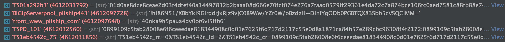
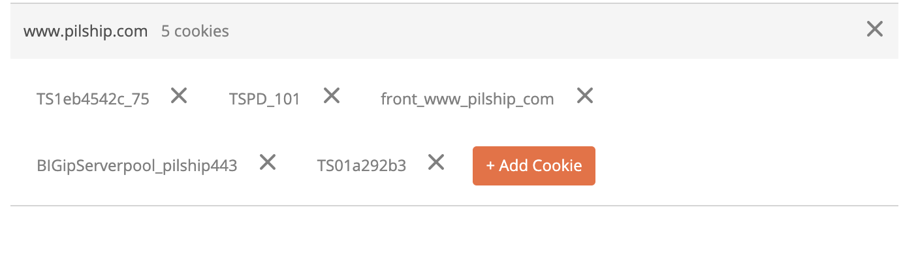

# PABV

## Flow Chart

```

     +---------+
     | Cookies |
     +---------+
          |
          v
      +-------+
      | Track |
      +-------+
          |
          v
    +-----------+
    | Container |
    +-----------+

```

Cookies
===
## 目的
取得 Cookies，給後面的 RoutingRule 使用

## selenium

```
class CookiesGetter:
    
    TIMEOUT = 40

    def __init__(self, phantom_js_service_args):
        self._browser = webdriver.PhantomJS(service_args=phantom_js_service_args)

    def get_cookies(self):
        self._browser.get(f'{PABV_BASE_URL}/en-our-track-and-trace-pil-pacific-international-lines/120.html')

        try:
            WebDriverWait(self._browser, self.TIMEOUT).until(self._is_cookies_ready)
        except TimeoutException:
            raise LoadWebsiteTimeOutError()

        cookies = {}
        for cookie_object in self._browser.get_cookies():
            cookies[cookie_object['name']] = cookie_object['value']

        self._browser.close()
        return cookies

    def _is_cookies_ready(self, *_):
        cookies_str = str(self._browser.get_cookies())
        return ('front_www_pilship_com' in cookies_str) and ('TS01a292b3' in cookies_str)
```

等到 front_www_pilship_com, TS01a292b3 這兩個 cookies 存在時，取出所有的 Cookies


## postman
連結 chrome 取得網站的 Cookies


Track
===
## 目的
取得 Mbl, Vessel, Container 的資訊


## 準備
Cookies
mbl_no

```
method = 'GET'
URL = 'https://www.pilship.com/shared/ajax/?fn=get_tracktrace_bl&ref_num={mbl_no}'
```

## postman


## scrapy

```
scrapy.Request(url=URL)
```

## requests

```
requests.get(url=URL)
```

Container
===
## 目的
取得 Container Status 的資訊

## 準備
Cookies
mbl_no
container_no

```
method = 'GET'
URL = 'https://www.pilship.com/shared/ajax/?fn=get_track_container_status&search_type=bl'&search_type_no={mbl_no}&ref_num={container_id}'
```

## postman


## scrapy

```
scrapy.Request(url=URL)
```

## requests

```
requests.get(url=URL)
```