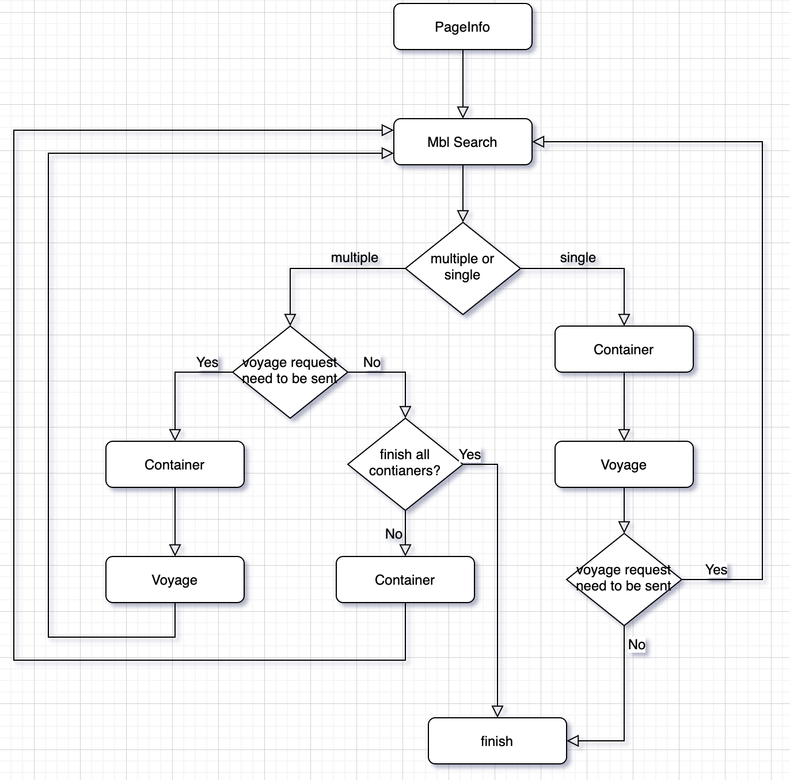
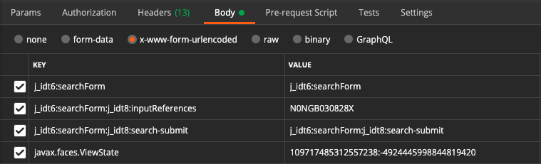
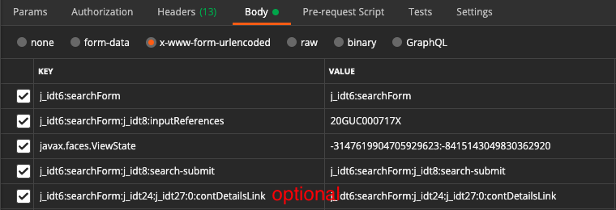
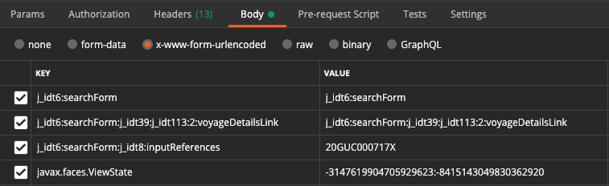

# SUDU

FlowChart
===


PageInfo
===
## 目的
response html 上有下一個 post request 所需的 form info
* input
    * name = javax.faces.ViewState
    * 需要 value
* form
    * 有 id
    * 需要 id(without ':searchForm')

PS: 每個 request 都需要這些資訊，與 mbl_no 彙整成 basic_request_spec
    
ex:

```html
<input type="hidden" name="javax.faces.ViewState" id="j_id1:javax.faces.ViewState:0" value="-6260519160453190883:8449238771652525933" autocomplete="off">
<form id="j_idt6:searchForm" name="j_idt6:searchForm" method="post" action="/linerportal/pages/hsdg/tnt.xhtml" enctype="application/x-www-form-urlencoded">
    ...
</form>
```

```
method = 'GET'
URL = 'https://www.hamburgsud-line.com/linerportal/pages/hsdg/tnt.xhtml'
```

## requests
```
sudu_session = requests.Session()

sudu_session.get(
    url=URL,
)
```

## scrapy
```
scrapy.Request(
    url=URL,
)
```

Mbl Search
===
## 目的
response html 上有 container 為多數或單個的狀態

response html 上有 container request 的 form_data 資訊 if 多個 containers
* container_link_element
* a
    * class="ui-commandlink ui-widget"
    * id


## 準備
basic_request_spec
* mbl_no
* view_state
* j_idt

## Flow
如果多個 container
* 藉由搜集的 container request 的 form_data 資訊來打 container

```
method = 'POST'
URL = 'https://www.hamburgsud-line.com/linerportal/pages/hsdg/tnt.xhtml'

j_idt2 = 'j_idt8' if basic_request_spec.j_idt == 'j_idt6' else 'j_idt9'
search_form = f'{basic_request_spec.j_idt}:searchForm'
FORM_DATA = {
    search_form: search_form,
    f'{search_form}:{j_idt2}:inputReferences': basic_request_spec.mbl_no,
    f'{search_form}:{j_idt2}:search-submit': f'{search_form}:{j_idt2}:search-submit',
    'javax.faces.ViewState': basic_request_spec.view_state,
}
```

## postman
FORM_DATA



## requests
```
sudu_session.post(
    url=URL,
    data=FORM_DATA,
)
```

## scrapy
```
scrapy.FormRequest(
    url=URL,
    formdata=FORM_DATA
)
```


Container
===
## 目的
response html 上有我們要的 container 資料

response html 上有 vessel request 的 form_data info
* PS:為了拿 xtd 需要打 vessel request

## 準備
basic_request_spec
* mbl_no
* view_state
* j_idt

container_link_element(optional)


### 共分為兩種 request
只有一個 container

```
method = 'POST'
URL = 'https://www.hamburgsud-line.com/linerportal/pages/hsdg/tnt.xhtml'

j_idt2 = 'j_idt8' if basic_request_spec.j_idt == 'j_idt6' else 'j_idt9'
search_form = f'{basic_request_spec.j_idt}:searchForm'
FORM_DATA = {
    search_form: search_form,
    f'{search_form}:{j_idt2}:inputReferences': basic_request_spec.mbl_no,
    f'{search_form}:{j_idt2}:search-submit': f'{search_form}:{j_idt2}:search-submit',
    'javax.faces.ViewState': basic_request_spec.view_state,
}
```

兩個以上 containers
```
method = 'POST'
URL = 'https://www.hamburgsud-line.com/linerportal/pages/hsdg/tnt.xhtml'

j_idt2 = 'j_idt8' if basic_request_spec.j_idt == 'j_idt6' else 'j_idt9'
search_form = f'{basic_request_spec.j_idt}:searchForm'
FORM_DATA = {
    search_form: search_form,
    f'{search_form}:{j_idt2}:inputReferences': basic_request_spec.mbl_no,
    f'{search_form}:{j_idt2}:search-submit': f'{search_form}:{j_idt2}:search-submit',
    'javax.faces.ViewState': basic_request_spec.view_state,
    container_link_element: container_link_element,
}
```

## postman
FORM_DATA



## requests
```
sudu_session.post(
    url=URL,
    data=FORM_DATA,
)
```

## scrapy
```
scrapy.FormRequest(
    url=URL,
    formdata=FORM_DATA,
)
```


Voyage
===
## 目的
response html 上有 voyage 的 estimate time

## 準備
basic_request_spec
* mbl_no
* view_state
* j_idt

voyage_link_element


```
method = 'POST'
URL = 'https://www.hamburgsud-line.com/linerportal/pages/hsdg/tnt.xhtml'
j_idt2 = 'j_idt8' if basic_request_spec.j_idt == 'j_idt6' else 'j_idt9'
search_form = f'{basic_request_spec.j_idt}:searchForm'
form_data = {
    search_form: search_form,
    f'{search_form}:{j_idt2}:inputReferences': basic_request_spec.mbl_no,
    'javax.faces.ViewState': basic_request_spec.view_state,
    voyage_link_element: voyage_link_element,
}
```

## postman
FORM_DATA




## requests
```
sudu_session.post(
    url=URL,
    data=FORM_DATA,
)
```


## scrapy

```
scrapy.FormRequest(
    url=URL,
    formdata=FORM_DATA,
)
```


