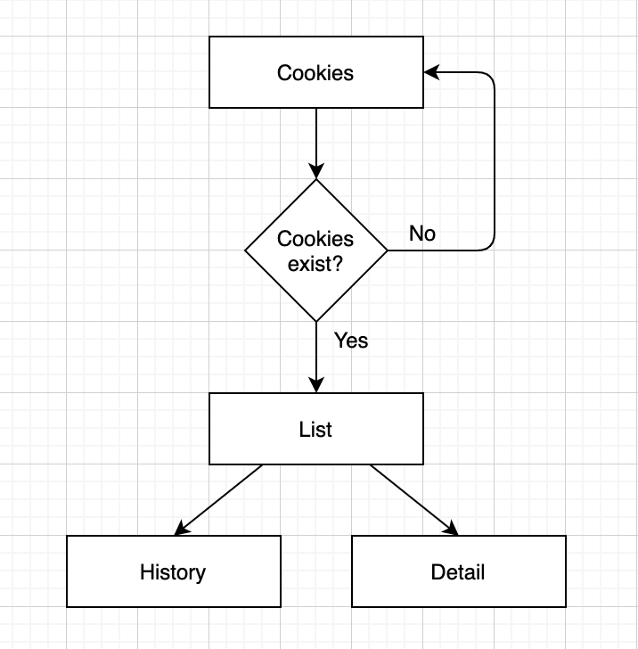

# WHLC



Cookies
===

## 目的
取得 Cookies, view_state

## 準備
```
method = 'GET'
URL = 'https://www.wanhai.com/views/Main.xhtml'
```

## Flow
1. 確認 response 有沒有拿到 Cookies，沒有就再發一次 request
2. 取得 view_state

## scrapy
```
scrapy.Request(URL)
```

## requests
```
requests.get(URL)
```

List
===

## 目的
取得 view_state, detail_j_idt, history_j_idt 
取得 container_no

## 準備
view_state
mbl_no

```
method = 'POST'
URL = 'https://www.wanhai.com/views/quick/cargo_tracking.xhtml'
FORM_DATA = {
    'cargoTrackListBean': 'cargoTrackListBean',
    'cargoType': '2',
    'q_ref_no1': mbl_no,
    'quick_ctnr_query': 'Query',
    'javax.faces.ViewState': view_state,
}
```

## Flow
1. 確認是否有這張單
2. 取得 view_state
3. 取得 container_no, detail_j_idt, history_j_idt

## scrapy
```
scrapy.FormRequest(
    url=URL,
    formdata=FORM_DATA,
)
```

## requests
```
requests.post(url=URL, data=FORM_DATA)
```

Detail
===

## 目的
取得 Vessel Item 的資訊

## 準備
view_state
detail_j_idt
mbl_no
container_no

```
method = 'POST'
URL = 'https://www.wanhai.com/views/cargoTrack/CargoTrackList.xhtml'
FORM_DATA = {
    'cargoTrackListBean': 'cargoTrackListBean',
    'javax.faces.ViewState': view_state,
    j_idt: j_idt,
    'q_bl_no': mbl_no,
    'q_ctnr_no': container_no,
}
```

## scrapy
```
scrapy.FormRequest(
    url=URL,
    formdata=FORM_DATA,
)
```

## requests
```
request.post(url=URL, data=FORM_DATA)
```


History
===

## 目的
取得 ContainerStatus Item 的資訊

## 準備
view_state
history_j_idt
mbl_no
container_no
```
method = 'POST'
URL = 'https://www.wanhai.com/views/cargoTrack/CargoTrackList.xhtml'
FORM_DATA = {
    'cargoTrackListBean': 'cargoTrackListBean',
    'javax.faces.ViewState': view_state,
    j_idt: j_idt,
    'q_bl_no': mbl_no,
    'q_ctnr_no': container_no,
}
```

## scrapy
```
scrapy.FormRequest(
    url=URL,
    formdata=FORM_DATA,
)
```

## requests
```
request.post(url=URL, data=FORM_DATA)
```
