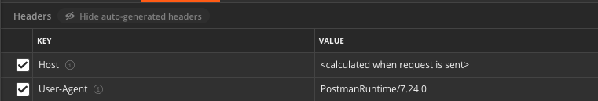
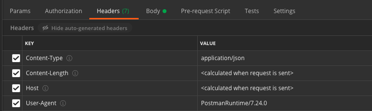
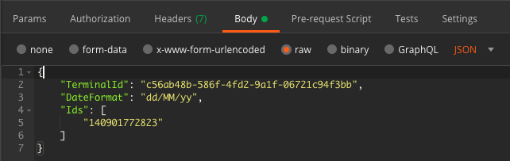

# APM

```
+--------------+     terminal_id      +-------------+
|  TerminalId  |  ----------------->  |  Container  |
+--------------+     container_no     +-------------+
```

# TerminalId

## 目的
response html 上有 Container 所需要的 terminal 參數: terminal_id 
* div attr = `data-terminal-id`

## 準備
terminal_abbrev_name

```
method = 'GET'
URL = f'https://www.apmterminals.com/en/{terminal_table[terminal_abbrev_name]}'
HEADERS = {
    'Host': 'www.apmterminals.com',
}
```

## postman
HEADERS



## requests
```
requests.get(url=URL, headers=HEADERS)
```

## scrapy
會自動加 Host
```
scrapy.Request(
    url=URL,
)
```

# Container

## 目的
獲取 container 資料

## 準備
從 TerminalId 拿到的 terminal_id
* div attr = `data-terminal-id`

container_no(可複數)

```
method = 'POST'
URL = 'https://www.apmterminals.com/apm/api/trackandtrace/import-availability'
HEADERS = {
    'Host': 'www.apmterminals.com',
    'Content-Type': 'application/json',
}
FORM_DATA = {
    "TerminalId": terminal_id,
    "DateFormat": "dd/MM/yy",
    "Ids": [
        container_no,
    ]
}
```

## postman
HEADERS



FORM_DATA



## requests
```
requests.post(
    url=URL,
    headers=HEADERS,
    data=json.dumps(FORM_DATA),
)
```

## scrapy
```
scarpy.Request(
    method='POST',
    url=URL,
    headers=HEADERS,
    body=json.dumps(FORM_DATA),
)
```
