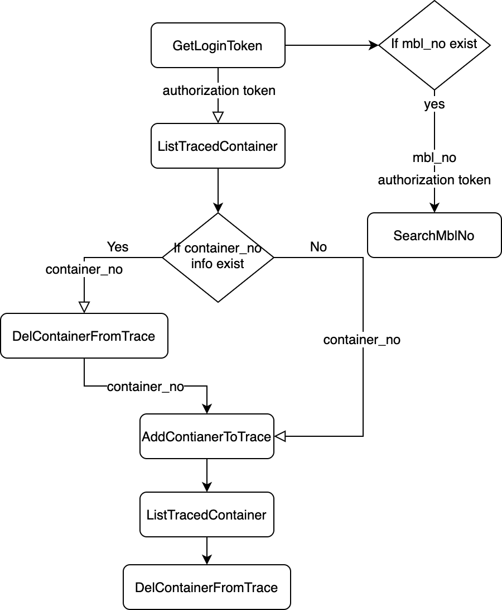

# FENIX



# GetLoginToken

## 目的
response json 上有後面 header 需要的 authorization token
* `'token': authorization_token`

## 準備
一組帳密
* email
* password
```
method = 'POST'
URL = 'https://fenixmarine.voyagecontrol.com/api/jwt/login/?venue=fenixmarine'
HEADERS = {
    'Content-Type': 'application/json',
    'Host': 'fenixmarine.voyagecontrol.com',
}
FORM_DATA = {
    'email': email,
    'password': password,
}
```

## postman
HEADERS


FORM_DATA


## requests
```
response = requests.post(
    url=URL, 
    headers=HEADERS
    data=json.dumps(FORM_DATA), 
)
```

## scrapy
```
scrapy.Request(
    method='POST',
    url=URL,
    headers=HEADERS,
    body=json.dumps(FORM_DATA),
)
```

# ListTracedContainer

## 目的
response json 裡有所有列入追蹤的 container statuses

## 準備
GetLoginToken response json 上 authorization token
* `'token': authorization_token`

```
method = 'GET'
URL = 'https://fenixmarine.voyagecontrol.com/lynx/container/?venue=fenixmarine'
HEADERS = {
    'Host': 'fenixmarine.voyagecontrol.com',
    'authorization': 'JWT ' + authorization_token',
}
```


## postman
HEADERS


## requests
```
response = requests.get(url=URL, headers=HEADERS)
```

## scrapy
```
scrapy.Request(
    url=URL,
    headers=HEADERS,
)
```

# AddContainerToTrace

## 目的
將 container 加入追蹤清單

## 準備
GetLoginToken response json 上 authorization token
* `'token': authorization_token`

container_no(可複數)

```
method = 'POST'
URL = 'https://fenixmarine.voyagecontrol.com/lynx/container/ids/insert?venue=fenixmarine'
HEADER = {
    'Host': 'fenixmarine.voyagecontrol.com',
    'Content-Type': 'application/json',
    'authorization': 'JWT ' + authorization token,
}
FORM_DATA = {
    "containerIds": [container_no1, container_no2, ...],
}
```

## postman
HEADERS


FORM_DATA


## requests
```
response = requests.post(
    url=URL, 
    headers=HEADERS, 
    data=json.dumps(FORM_DATA),
)
```

## scrapy
```
scrapy.Request(
    method='POST',
    url=URL,
    headers=HEADERS,
    body=json.dumps(FORM_DATA),
)
```

# DelContainerFromTrace

## 目的
將 container 從追蹤清單刪除

## 準備
GetLoginToken response json 上 authorization token
* `'token': authorization_token`

container_no(可複數)

```
method = 'POST'
URL = 'https://fenixmarine.voyagecontrol.com/lynx/container/ids/delete?venue=fenixmarine'
HEADER = {
    'Host': 'fenixmarine.voyagecontrol.com',
    'Content-Type': 'application/json',
    'authorization': 'JWT ' + authorization token,
}
FORM_DATA = {
    "containerIds": [container_no1, container_no2],
    "bookingRefs":[null, null, ...],
}
```

## postman
HEADERS


FORM_DATA


## requests
```
response = requests.post(
    url=URL, 
    headers=HEADERS, 
    data=json.dumps(FORM_DATA),
)
```

## scrapy
```
scrapy.Request(
    method='POST',
    url=URL,
    headers=HEADERS,
    body=json.dumps(FORM_DATA),
)
```

# SearchMbl

## 目的
獲取 mbl_no 的資料

## 準備
GetLoginToken response json 上 authorization token
* `'token': authorization_token`

mbl_no

```
method = 'GET'
URL = 'https://fenixmarine.voyagecontrol.com/api/bookings_inquiry/'
      'landingbill/?param={mbl_no}&venue=fenixmarine'
HEADER = {
    'Host': 'fenixmarine.voyagecontrol.com',
    'Content-Type': 'application/json',
    'authorization': 'JWT ' + authorization token,
}
```

## postman
HEADERS


## requests
```
response = requests.get(url=URL, headers=HEADERS)
```

## scrapy
```
scrapy.Request(
    url=URL,
    headers=HEADERS,
)
```


