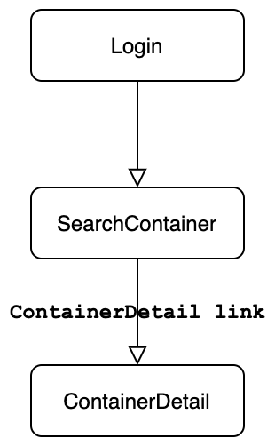
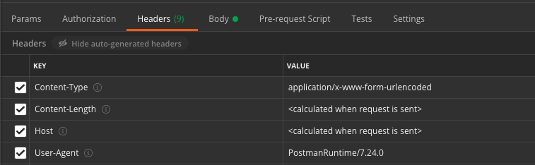
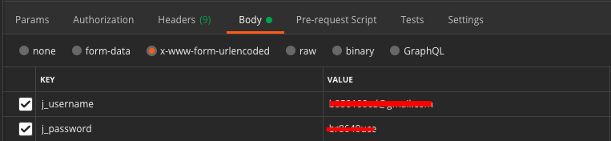
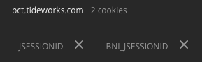
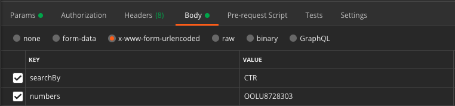
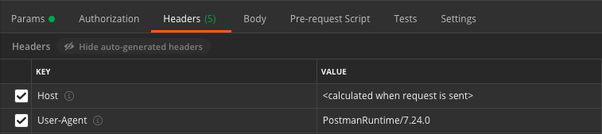

# PCT


# Login

## 目的
登入並取得 cookies

## 準備
一組帳密
* email
* password

```
method = 'POST'
URL = 'https://pct.tideworks.com/fc-PCT/j_spring_security_check'
HEADERS = {
    'Host': 'pct.tideworks.com',
}
FORM_DATA = {
    'j_username': email,
    'j_password': password,
}
```

## postman
HEADERS



FORM_DATA



COOKIES



## requests
```
pct_session = requests.Session()
pct_session.headers.update(HEADERS)
pct_session.post(url=URL, data=FORM_DATA)
```

確認 cookies 存在
```
print(f'Login Cookies: {pct_session.cookies.get_dict()}')
# Login Cookies: {'BNI_JSESSIONID': '000000000000000000000000156b15ac0000921f', 'JSESSIONID': '7EC8D59C6A775E2884D155B1CFB00ED0'}
```

## scrapy
scrapy 會自己加入 Host & Referer
```
scrapy.FormRequest(
    url=URL,
    formdata=FORM_DATA,
)
```

確認 cookies 存在
```
print(response.headers.get_list('Set_Cookie'))
# [b'JSESSIONID=4792AB15BECA802E8346942FB62A3413; Path=/fc-PCT/; Domain=pct.tideworks.com; HttpOnly;',
#  b'BNI_JSESSIONID=000000000000000000000000156b15ac0000921f; Path=/; Domain=pct.tideworks.com;']
```

# SearchContainer

## 目的
response html 上有 container detail 的 link
* div id = `result`
* table

  | Container                  | Available? | Size/Type | Holds/Fees | Additional Information |
  | -------------------------- | ---------- | --------- | ---------- | ---------------------- |
  | container_detail link1     | ...
  | container_detail link2     | ...
  | ...                        | ...


## 準備
container no(可複數)

```
method = 'POST'
URL = 'https://pct.tideworks.com/fc-PCT/import/default.do?method=defaultSearch'
HEADERS = {
    'Host': 'pct.tideworks.com',
}
FORM_DATA = {
    'searchBy': 'CTR',
    'numbers': container_no,
}
```

## postman
HEADERS


FORM_DATA



## requests
login 已經 update headers 因此不需要再加入 headers
```
pct_session.post(url=URL, data=FORM_DATA)
```

## scrapy
```
scrapy.FormRequest(
    url=URL,
    form_data=FORM_DATA,
)
```

# ContainerDetail

## 目的
response html 上有 container no 的資料

## 準備
從 SearchContainer 拿到的 container_detail_link
* div id = `result`
* table

  | Container                  | Available? | Size/Type | Holds/Fees | Additional Information |
  | -------------------------- | ---------- | --------- | ---------- | ---------------------- |
  | container_detail link1     | ...
  | container_detail link2     | ...
  | ...                        | ...
  
```
method = 'GET'
URL = container_detail_link
HEADERS = {
    'Host': 'pct.tideworks.com',
}
```

## postman
HEADERS



## requests
```
pct_session.get(url=URL)
```

## scrapy
```
scrapy.Request(
    url=URL,
)
```

