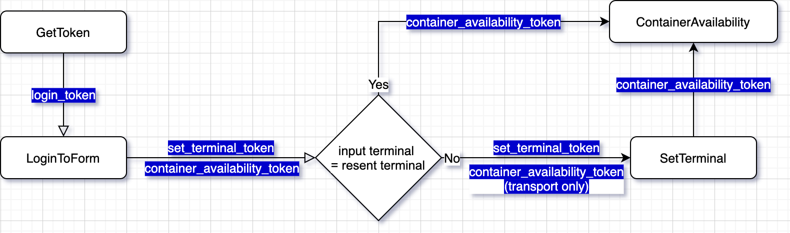

# TMS



GetToken
===
## 目的

response cookies 有 key=RequestVerificationToken_L3RtczI1
 
response html 有 token 可以給 LoginToForm 使用
```
method = 'GET'
URL = https://tms.itslb.com/tms2/Account/Login
```

## postman

將 tms.itslb.com 加入 cookies 觀察對象

* ref: [postman cookies document](https://learning.postman.com/docs/postman/sending-api-requests/cookies/)

## requests
使用 requests.Session 目的是為了保存 cookies
```
tms_session = request.Session()
tms_session.get(url=URL)
```

## scrapy

```
scrapy.Request(
    url=URL,
)
```

---
LoginToForm
===
### 目的

URL 的後面加東西是為了 redirect 到搜尋頁面好讓我們拿 token

response cookies 有 key=.AspNet.ApplicationCookie

response html 有 token 可供 SetTerminal 使用

response html 有 token 可供 ContainerAvailability 使用

### 準備

從 GetToken 回傳的 HTML 取得 login_token
* section id = `loginForm` 
* input name = `__RequestVerificationToken`

存在 cookies
* key = `RequestVerificationToken_L3RtczI1`

```
method = 'POST'
URL = https://tms.itslb.com/tms2/Account/Login?ReturnUrl=%2Ftms2%2FImport%2FContainerAvailability
FORM_DATA = {
    '__RequestVerificationToken': login_token,
    'UserName': username,
    'Password': password,
}
```
### postman
確認存在 cookies key=RequestVerificationToken_L3RtczI1

* ref: [postman cookies document](https://learning.postman.com/docs/postman/sending-api-requests/cookies/)

FORM_DATA 可用 form-data 或是 x-www-form-unlencoded

1. 使用 form-data

    headers 為空

2. 使用 x-www-form-unlencoded

    headers 需加入 `'Content-Type' : 'x-www-form-unlencoded'`
    
### requests

確認 Session 存在 cookies key=RequestVerificationToken_L3RtczI1
```
print(dict(tms_session.cookies))
# {'__RequestVerificationToken_L3RtczI1': 'CWjaGKwoy70gM1XE35rY6l3Ghdd_WKB7BwXrspiSfjk4cv9eD6--nUvPP6SH_0Cpg9hFeYiyI77h0xFSW-sJJdsS2hwayft9Cfhjh3Ka1eE1'}
```
```
tms_session.post(url=URL, data=FORM_DATA)
```

### scrapy
確認 response 存在 cookies key=RequestVerificationToken_L3RtczI1
```
print(response.headers.getlist('Set-Cookie'))
# [b'__RequestVerificationToken_L3RtczI1=Pz2vHKVwnhP8E2JZh4FiTYaD_t5GK4Jv0pMmqO78kHSzpI_-aebEmDtIRGW1yH37ej3A8LG3-0naiOludzkD3Vfv7u_PP7q-bsSe0DOwnQU1; path=/; HttpOnly']
```
**debug only**

為了在 debug 時看到 redirect 網頁拿到的 cookie  
我們需要在 meta 加入 handle_httpstatus_list  
[handle_httpstatus_list doc](https://docs.scrapy.org/en/latest/topics/spider-middleware.html#std:reqmeta-handle_httpstatus_list)
```
scrapy.FormRequest(
    url=URL,
    formdata=FORM_DATA,
    meta={
        'handle_httpstatus_list': [302], 
    },
)
```

---
SetTerminal
===
### 目的
根據目前的 terminal 與 要搜尋的 terminal 是否一致
 
來確定是否要改變 terminal

不一致則改變，反之則不改

tms 總共有兩個 terminal : Id
   * ITS Long Beach : 1（此為 Brain 帳號預設）
   * Husky Tacoma : 3
   
### 準備
從 GetToken 回傳的 HTML 取得 login_token
* form id = `TerminalForm`
* input name = `__RequestVerificationToken`

存在 cookies
* key = `.AspNet.ApplicationCookie`

```
method = 'POST'
URL = https://tms.itslb.com/tms2/Account/SetTerminal
FORM_DATA = {
    '__RequestVerificationToken': set_terminal_token,
    'loginTerminalId': terminal_id,
}
```
### postman
確認存在 cookies key=.AspNet.ApplicationCookie

其餘參考 LoginToForm

### requests
確認 Session 存在 cookies key=.AspNet.ApplicationCookie
```
print(dict(tms_session.cookies))
# {
#old#    '__RequestVerificationToken_L3RtczI1': 'CWjaGKwoy70gM1XE35rY6l3Ghdd_WKB7BwXrspiSfjk4cv9eD6--nUvPP6SH_0Cpg9hFeYiyI77h0xFSW-sJJdsS2hwayft9Cfhjh3Ka1eE1',
#new#    '.AspNet.ApplicationCookie': 'EqRvUHjkB_-Ax9TgBsdcKvDL4F1oyyByHLU6zSC6Tj9eb3EpAo8UesciaFRVuwQku6Vq1kKA6r4ZfrT5MyfDKhBWbinzEp7ouhV7R59VJ7Q-NWBmSwWKOAB1YeaT0xcXzAWBEUptTH1FfVrR1fFF0NUKxt-CdsN1lmJbjQsDL_ztfCXuFsYttDu7aomN9mUXRspahHxHgkkPx1f00M9Qm0iaJjR36RGIHIkPSxZW63Z1A9fBPWzQoZte3eS7-XeUlvCudRNt9JkcKyh3wQgCWL-B1YJumAmDevwTwthSUekg-mjOSHV-Cp9__1Nhut1xRqD-IJGsw85AOtZpSd4o8ecm_auRb4jYRbXuYMvoOqLhRn3vVwtbk0trZHNTYOTLli0LOLjaXTKQR_aveD2fWcrSyPv4uik3MfF2RRb6wcb4q3VRCpRVZU4kpUmLqizSmMel0rtx5fRdCJ5oQu_X6qNdwdfGA_YXoX5Cb3Tv1wEqcgt8T2VXyocCfIPULlU3_NgDGhdFbMHTpY1ohRnm5SyG2Uw5nKS7lP6Aew8zocedtojpboDowSuOmQdeLGP35VxfoBaohQshosgclVAo73nbNvP4jyYRVFpkOyAetHslkfuk_1HXWem79J9nZQTqEyc05wntD0cuFrycx9PL_dgRpA2ADsZ4mBYTi-SOMWR1nMK_K7jycTifWJ_45PIIRprD08AD1VDtpCV9rop28LRM0p1aSTQ0wL2DTbRKA-MbCN6dGlzwNNE9J8Ws1pUxwhIWcX_moSFSd8v6D7bumfdyFPLQhRub1U2dC6-Xe8RoAg89VC0x7nAfBXBCRwBeGeRglHPybW7io9C479PkAXeIMF2xJ0LI6fXa-5FAguMJdrm6b3ChrWa5i_G_2wgICRirqYjckqrLoyRzQi-2iaNKODwAVyKD9tqn-lgQRqlvHUbBFEU0j2QTnLQEu6lwE7V1C1j5zfodqC6UPehq9cYl68_UzhGKS_s6ZIwl4cWrIADERMFN-qXXhBJKlIK8I9h19GivR1dK2TbxSgZ-jAtCr5qYwcj_YV81En3Z6YEE-cdyCLEEMxWk2pQdsABkzws7U7N0vDv4EIaOgGSFlMHfiuN5H2fANm656s4TVD98ZrxlrXtlemYu_KcCjIKwcCMD5mXJtKPjkzxuBKGvbf1_-uJ7HntCXjswq9ArlYsEw28sgNHaempCiXfVi8-Vidde7lV4hLv89M35NNugplcGh34iX-5f2ktl02uyb3kNvClt4XeG9eVFnEt9y0EPAtDvjR_siSVmZEnBm7ZBn8NndPQGKL2zp75f_pO5S24',
# }
```
```
tms_session.post(url=URL, data=FORM_DATA)
```

### scrapy
確認 response 存在 cookies key=.AspNet.ApplicationCookie
```
print(response.headers.getlist('Set-Cookie'))
# [b'.AspNet.ApplicationCookie=TS5n2hQzdJHdBkBVNQpPK9XjuS1cfWhAa6oiBSOOfAnqTHn3T88ijxK4bsRhImE-sfvCv_nT3O-mcpgK00W1ODzeJJY6gTd8HzxoLUpW8FUf4_afPsn3pbB-A6AClyPhnOii8BT7oxuzNHOcN52TdCZ7lgsUmCMtvYsIZK5RDbnyn9XsTQzyTqNkYm_8jobmVn3_E4YexZF5sudwkFl1TVhKbV2IFVQK_1K8LkQ4CczHinFSjXRUMgAVnXig-XoRJ7NU2SCBHfcfs9e1u3MT8gs5CCZaZEBZ12FoYD2kv5vHjo7wpfBUxol2Zm7YZhsmFSpVvr4TtWTJLbrY9vTVVnr2NlUJjfAAU2r0xmqhPs1So2-MJ1uYaYYlO7LoEC2QrVVhl1AuvToZ0Ek3w2-jUKhhnBtF1BJjLEZe589gcIUbZHpeOchnq2uMc5IosxNGF-gAT5HlcJjUpPsU3TGJ29NkD0CoNw14eZCMaHMy1tflVQxjbWeHWrQKjiLl1yaT2cgeRxYRWdAd2AGxpZdjqdj7rulskBvwq56pWvJb_vtNPfzovd_UhDhYrMIOvNXN5YcOiz3Nt9Yz_KhSeVulQZeHqhxqfJXrsbfdFfhmi3qTyaOHmY-5y2uw7OOE_QwY5AQcRLDmcCzeUsEUVK4nurzXWbMB7pgpaYGyezN0TtjdX3vc76mOeOzrXNWJd4_W2Z8cBS6-2-i1eR1ClaMIpdb3ZE9YYwbyVJ1xrDtKl9FL3vTMQfOMXtf1iRvbieD3D5AVrkbGmkNdUuvkDTmes5sVYfv-74y3ersOakPYJwcnkRRvu7509I-fIgxajB3ota9mF3_kgHKm7X0vQzTSjj-dbcpgWzdlCi-l6q1RkGRVAtFg3lDOxxQmq82VDZwprkDXR3ta2HG7dmsW38LHDmZZQNy8mBFZ5ABZnm__JEGAQPwZVuXOI0XTK9aZxAfjG4miZGEkUTTlUSnJWfHNoXXiIcKULhCBY_YYLKg0Aq3QKdD-gq0SoerpntsxVEHe5mEkS2D-je5u2dn-qXjyx558fr0VJoF9YhpgXDaVzHrHGBKnjVsZ2EDYqjCWdaeynBA6-ifCAp58MezEx7SFHXTW94BgHzKM8SCzhzK7qpryLVKzJ04hdR8tTtG9T-9pElJIE7m74y0iwcdGx2kI-rlfhirekWidCH1BZvx2jvZLhjGQ7Sh5tPArU8S9HAP224woBHsPm6JM2Y37KSGiiqI-MuDpyy-Xl4KZ_yCvgX7jvJRaDbNPGJCytOtrZy2SWz9EZRxB2EyRVIhAQRj6nBY85nvPW0arCgdm5iD7I0ObgrFg1j7W4VmBCxqI5edf; path=/; secure; HttpOnly']
```
```
scrapy.FormRequest(
    url=URL,
    formdata=FORM_DATA,
    meta={
        'handle_httpstatus_list': [302],  # for cookie debug propose
    },
)
```

---
ContainerAvailability
===
### 目的
拿單號資料

### 準備
mbl_no

從 LoginToForm 回傳的 HTML 取得 login_token
* form id = formAvailabilityHeader
* input name = __RequestVerificationToken

更新 cookies
* key = `.AspNet.ApplicationCookie`
```
method = 'POST'
URL = https://tms.itslb.com/tms2/Import/ContainerAvailability
FORM_DATA = {
    '__RequestVerificationToken': container_availability_token,
    'pickupDate': mm/dd/yyyy(yesterday),
    'refNums': mbl_no,
    'refType': 'BL',
}

```

---
### postman
* 參考 LoginToForm

### requests
確認 Session cookies key=.AspNet.ApplicationCookie 的值更新
```
print(dict(tms_session.cookies))
# {
#old#    '__RequestVerificationToken_L3RtczI1': 'CWjaGKwoy70gM1XE35rY6l3Ghdd_WKB7BwXrspiSfjk4cv9eD6--nUvPP6SH_0Cpg9hFeYiyI77h0xFSW-sJJdsS2hwayft9Cfhjh3Ka1eE1',
#renew#    '.AspNet.ApplicationCookie': 'ocLC6jfSk8gXJbzgqgcCGEvtPG5jubp5Z_QfGpzVlE1QEykCdGdDSCRviDV4uZ7bmWWBY70ZF4wUxsoMJtmQxfMnxDWYtJDkBUBZcqhi5RrZX40bS2_rV0WGReLe4gNfqFeVberqoDUmy7JLjKrbGTAP8mbRNTd6JR0FtOPBaOYTn0GNk2FVPaeJV4jyE_09LZKXWysTnQ84vhGoZ96-EeExdI_VMsE9rdZSsUtM_c2zZAk4RXXFFtJArF9EKAANgBKNmi_zB02LdNyNxRFuPxchZxAtV8Xdj2AwE6AnwBNd6ut-H4wgTXp_slBu674Ua3artChPN9p8BbsFOKgeqZs-0_Cjh8ny1b0mdYFXcd1qIIx1Eg096KNlH-Wb5z4jE5Ff67a9vbzHY7f9HIaNzkhGrrOfjE4QBe59-eeQphDdVY3nIYe_4ctnA1ZRjYABfU2ucrpuneH_erNs27ZQoOkMmL943j2Azm10uzYh1Y5QxWQUnDfpJWjZ8RCW3UXhZqZoSBayDWcJeWDpvZ5KR1MCIHZTo_kV9JxHc0plGU5TF3it3dVTYpd2u2MCxJ7bXf7CGzZ9njrswRXFukOnlBImtWyFm4TrfPVx3IOxUR270D3vOhPXh2Vv7_VJ5ipS4HuKJ_zoKBpXCRp4odiQzgJbmRdzzFMZvok9J8Bi5grjweDqcHZTylc2gAj4dD40jTwZ5wDwcnDecZ-jwFyoxoWfhqSi1LdAE7HK0-ScXAUrBhUirQsuw11R-Sk7o4i7uS8tafB3dTenIf-f_6WKLj6LVQ4SqXYNBS5K4rHtNmgVu1e1ozTwZc4q7H7Mhu-gJ1UteeR5x-myqI3or8EFln8bMYBwXhcxYktkmqI-EK5kwivqduy2fKfWWolpdYpyhQZ3aO7bgAIbvQORFMAft8zigcAxs9A8MKZ7KyaOs2QdxoIZ1iUbu-Q2sXifFDBrpWRPl5ndejergZpFyX4yZdxF8bus3y2A6902DsaQBVbiX4Abc4jn7FT1Kvn0jB-lU-f9UvTMILUgx75OF_cg6Q4sxLN5xhYDwWP2qEHr1AqjkgqrLJut2tBl2uAzYJ9L40YY0QOp7Xk_UPRB-P7IWaq02y2UJKjfLex0jIQMr_P3qp3ykrnbQb0cs2G2_NKNfef1aSnXxNDpXoTLe4i0tL_gjRMxVFrHwzQ8sE89TsjqDhvys9F_3NSmFvsu2NU3boU1LFN7WxUUhzXAoVbpHpVJpacNIDjmSSRfaXV5IndWY29hsVtqpivU51mzrx7lN1ErKD9G3B1z0Hd0I_qRD6IlHR9yl-FR3hZoE2Igh2k',
# }
```
```
tms_session.post(url=URL, data=FORM_DATA)
```

### scrapy
確認 response 更新 key = .AspNet.ApplicationCookie 的 cookie
```
print(response.headers.getlist('Set-Cookie'))
# [b'.AspNet.ApplicationCookie=atGBcHL2Hn0kaVxnkq_Z-Sur_npDS9umpjXL-31SqJt-R5BCZBlBbKRKJVwq8QHvnJDohpfBHswhRdd2dtxBGyHJhueycAJJcPCHl7EjVDYT2myhx1Sa2WjlNAZmn0hvnShiKpnHzapz2p2HOQTf3j1SMFxDfAZ7ZpTtKwEaLb6ah_KmGXwRYZP7WW0mhy2uvf9H6xOrX2dGLgdLORXtYc8l-0QGF2TFB0xb_bVRj7u7fi4Vxt8WdH3pvZ0wKpDhu5C5bboN-jIrgpbKyVFUNhfOFbpdgOb3tsS3WfSBTQGDYGgBBkq576WVNL9GlU7ZXvdsqYd8pwy6-dAD6yKW243o4U4cZuN3kjEmmFUUmhkyxDlGuSDmzKDjzPAwtu1NL7QPjVD1iE3_OlW4OlpWuRa303teOhGea2Ik7hI5QyDblK_3cfWIHvGBMgnPD6cSc1QQCyZoG-B8U-70XXVz9Ko_CJZroqbUqCbnUkt_RshBn4L0TZteUzVrJHtaTZKXtVPXM4_-XZzASslkVoZtBaBXevfB8FUwdc4kONNfMTTyzN5vI3VVeVUOtwjR8rtgAP4Ov-vN57Uqq5lAAmqJewFtBFwzkdQdY8Zueb4ho9tZKRXBdBViDe5koaIDHM5x1Z2GCgk0mCLfgtb-17eYW5zfSh2Ov4Cq4j_eZTA34uxOD400OanPqVdQCorqDmmtCkTRBSFLNN5ghaGFNiiYhJffJjTE0el89cv7o3O7qduxbf7Tq7WCksOLVy9hyC4py2wq1ZrkTOpP7MwBtYj7-nVFpfz91Lg0a-MVzw5vhebOMK7uOMZoX8tlgmJ7H93fWPFcKmaqx3flHLCizP-QL-a2BG7ssgzF7iVRjfKCWletnq8FhopvKf6JZNy91upPbQIZhD6SQUAa1LeUmLVVshHtiM9cvLkggMInXV6jsmZwkacObIYBWejz0-Yf30XngFB79pDJpZXW2OewHPpkC1eMeGyJcYGuABoJZdYFI5yjvRQcwOrN5xL3AJwX9cOWFcMlwKqEvpxKL8jXBTIxb0Ui7x7UVa7rxRgj2cSohExUxDyUsyXAPI71DkbQMmbEnb4xrqIXbvz6bvZjugYgpBTSTetVIbPWz4rENW4Rib6m8rx3UURy9teR9wIUrVxBXqtrDBfcyylDNWoT_O1uUl7RKNYjyVo9X6rCJbhduA00hfK5QBDZ0iNv4xjlSe6Y038LuEdxulx5rGtexNB3yvvNzc6gFcJAO08n_PRvj28ZmOykba1huHaVsCqS0qzFzpRcqkr8FQE0oHTQXttBaY1C6xEihLDGTUaP2IQAYPHtNrypo9Sk2NyRPC7nPTuP; path=/; secure; HttpOnly']
```

```
scrapy.FormRequest(
    url=URL,
    formdata=FORM_DATA,
)
```