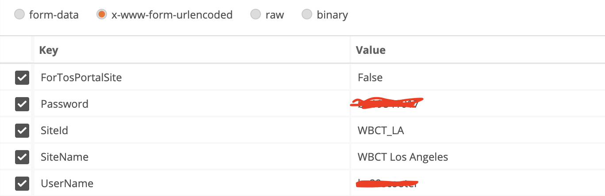
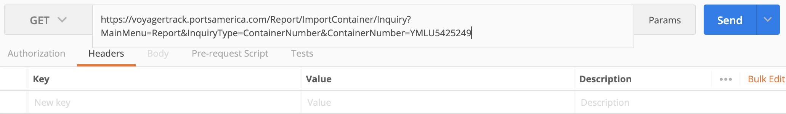

# TOS

# Login

## 目的
登入並取得 cookies

## 準備
一組帳密
* user name
* password

```
method = 'POST'
URL = 'https://voyagertrack.portsamerica.com/logon'
FORM_DATA = {
    'SiteId': 'WBCT_LA',
    'SiteName': 'WBCT Los Angeles',
    'ForTosPortalSite': 'False',
    'UserName': 'hc89scooter',
    'Password': 'bd19841017',
}
```

## postman

FORM_DATA


## requests

```
tos_session = requests.Session()
tos_session.post(url=URL, data=FORM_DATA)
```

## scrapy

```
scrapy.FormRequest(
    url=URL,
    form_data=FORM_DATA,
)
```


# Container Detail

## 目的
取得 container 資訊

## 準備
* container_no

```
method = 'GET'
URL = 'https://voyagertrack.portsamerica.com/Report/ImportContainer/Inquiry?MainMenu=Report&InquiryType=ContainerNumber&ContainerNumber=YMLU5425249'
```

## postman


## requests

```
tos_session.get(url=URL)
```

## scrapy

```
scrapy.Request(url=URL)
```
