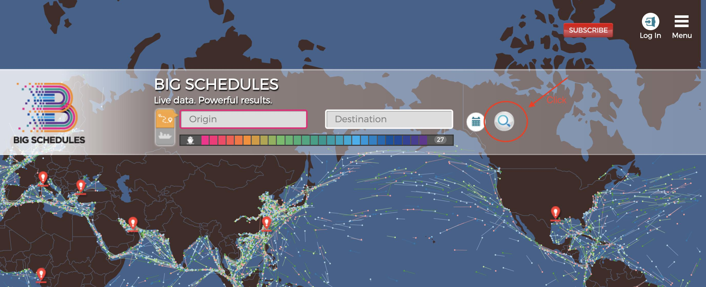

# Big Schedule

## 1. Login

### 目的

登入並拿到 Set-Cookies 的 cookies

### 準備
1. email
2. password

```
URL = 'https://www.bigschedules.com/api/admin/login'

headers = {
    'Accept': 'application/json, text/plain, */*',
    'Sec-Fetch-Dest': 'empty',
    'Content-Type': 'application/json;charset=UTF-8',
}

body = {
    "emailAddress": email,
    "password": password,
    "DISABLE_ART":"true",
}
```

### Postman
```
METHOD = POST
```

### Selenium
```
browser.execute_script(jquery)
ajax_query = "$.post('api/admin/login', {'emailAddress': '%s', 'password': '%s', 'DISABLE_ART': 'true'})" % (email, password)
browser.execute_script(ajax_query)
```

### Requests
```
response = requests.post(url, data=data, headers=headers)
```

### Scrapy
```
scrapy.Request(url=url, body=body, headers=headers)
```


## 2. Get Carrier Id

### 目的

從 response 的 json 中找到 carrierID

### Flow
1. 打 api 得到 carrierID 的 list
```
[
    {
        "scac": "COSU",
        "carrierID": "2",
        ...
    },
    {
        "scac": "APLU",
        "carrierID": "3"
        ...
    },
    ...
]
```
2. 透過 scac(spdier's input) 從 json 裡找到相對應的 carrierID


### 準備
1. scac (spider 的 input)

```
URL = 'https://www.bigschedules.com/api/carrier/fuzzyQuery'
```

### Postman
 
```
METHOD = GET
```

### Requests
```
response = requests.get(url)
```

### Scrapy
```
scrapy.Request(url)
```

## 3. Get Vessel Gid

### 目的
在 response 的 json 得到 vesselGid

### Flow
用 carrierID 和 vessel_name(spider's input) 當成 parameter 打 api 得到 vesselGid
```
[
    {
        "name": "CMA CGM FIDELIO",
        "vesselGid": "V000001036",
    }
]
```

### 準備
1. carrierID (由 Get Carrier ID 得到)
2. vessel_name (spider's input)

```
URL = 'https://www.bigschedules.com/api/vessel/list'

params = {
    'carrierId': carrierID,
    'vesselName': vessel_name,
}
```

### postman

```
METHOD = GET
```

### requests
```
response = requests.get(url, params=params)
```
    
### scrapy
```
scrapy.Request(url)
```

## 4. Get User Detect Cookie

### 目的
得到 USER_BEHAVIOR_DETECT 這個 Cookie

### FLow
1. 用 selenium 開啟網頁
2. 點擊 search button，讓 js 產生 cookie
3. 把 cookie 抓下來

### Selenium



## 5. Get Vessel Schedule

### 目的
得到 Vessel Schedule 

### 準備
1. local_date_time (YYYYMMDDHH)
2. carrierID (由 Get Carrier ID 得到)
3. vesselGid (由 Get Vessel Gid 得到)
4. scac (spider's input)
5. vessel_name (spider's input)
6. cookies (Login & Get User Detect Cookie 的 cookies)

```
URL = 'https://www.bigschedules.com/api/vesselSchedule/list'

headers = {
    'accept': "application/json, text/plain, */*",
    'sec-fetch-dest': "empty",
}

params = {
    'DISABLE_ART': 'true',
    '_': local_date_time,
    'carrierId': carrierID,
    'scac': scac,
    'vesselGid': vesselGid,
    'vesselName': vessel_name,
}
```

### postman
```
METHOD = GET
```

### requests
```
response = requests.get(url, params=params, headers= headers, cookies=cookies)
```

### scrapy
```
scrapy.Request(
    url=url,
    headers=headers,
    cookies=cookies,
)
```
